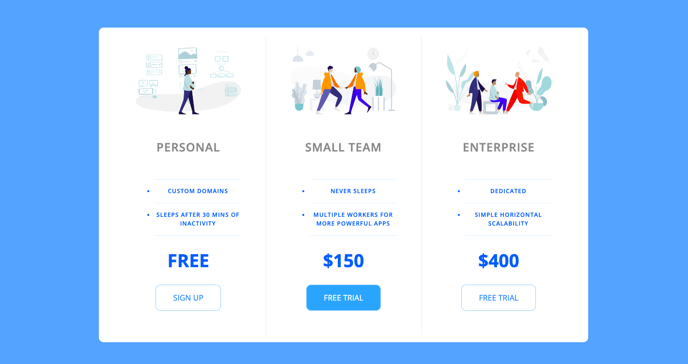

# Simple Pricing panel

## Table of contents

- [Overview](#overview)
  - [Project goal](#project-goal)
  - [Screenshot](#screenshot)
  - [Links](#links)
  - [Built with](#built-with)
  - [Useful resources](#useful-resources)

## Overview

### Project goal

Users should be able to:

- View the optimal layout for the site depending on their device's screen size

### Screenshot

### Links

- Live Site URL: [Add live site URL here](https://your-live-site-url.com)

### Built with

- Semantic HTML5 markup
- CSS custom properties
- Flexbox
- Mobile-first workflow

### Useful resources

- [Google font](https://fonts.google.com/) - This helped me to use different fonts. I really liked it and it is easy to use.

